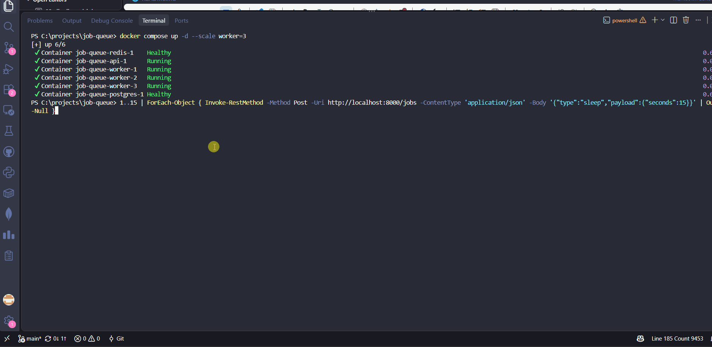
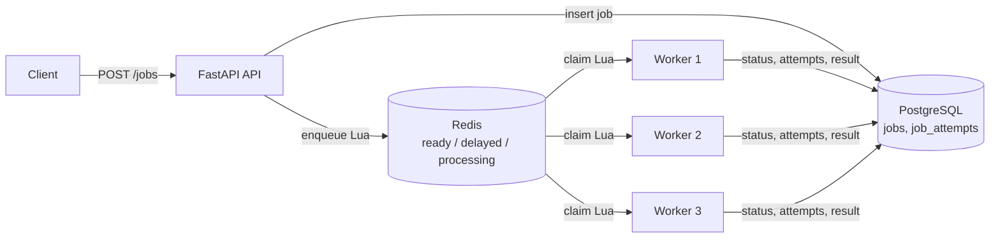
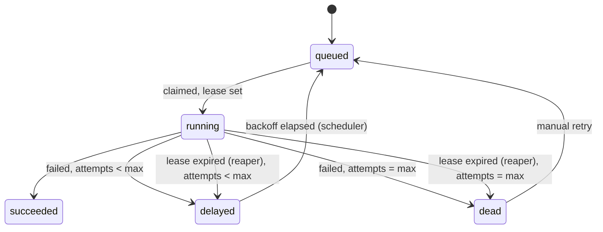

# Distributed Job Queue


A job queue (think a small Celery or BullMQ) built with FastAPI, Redis and PostgreSQL. Clients submit jobs over a REST API, and multiple worker processes execute them with priorities, retries with exponential backoff, a dead-letter queue, idempotent submission, and **automatic recovery of jobs held by crashed workers**.

**Live demo (may be offline):** https://distributed-job-queue-production-072b.up.railway.app/dashboard
The demo API has no authentication. API docs are at `/docs`.



## What happens if a worker crashes mid-job?

Its heartbeat stops, its lease expires, the reaper requeues the job, and another worker runs it. A chaos test in CI kills a worker every run and asserts that no job is lost.

| Run | What was done | Result |
|---|---|---|
| Local (3 workers) | 20 jobs of 10s, `docker kill` the worker holding 5 of them | All 20 succeeded in about 48s; the 5 held jobs finished with `attempts = 2` |
| Live (Railway) | 60s job, restarted the worker service mid-run | Stayed `running` until the lease expired, went `delayed`, then `running attempts=2`, then `succeeded` |

## Features

- Priorities (0 = highest, default 5), FIFO within a priority
- Retries with exponential backoff and jitter, then a dead-letter queue with a manual retry endpoint
- Worker heartbeats, job leases and a reaper that reclaims expired leases
- Idempotent submission with an `Idempotency-Key` header
- Atomic job claiming with Redis Lua scripts (two workers can never claim the same job)
- Recovery sweep that repairs Redis from PostgreSQL after data loss or a crash between commit and enqueue
- Single-page dashboard (`/dashboard`): queue depth, workers, recent jobs, DLQ with a retry button

## Architecture



Every worker also runs three background loops: the **scheduler** (moves due jobs from `delayed` to `ready`), the **reaper** (reclaims expired leases) and the **recovery sweep** (reconciles PostgreSQL with Redis).

### Job lifecycle



### Redis keys

| Key | Type | Meaning |
|---|---|---|
| `queue:ready` | ZSET | score = `priority * 10^13 + enqueue_ms` (lower runs first, FIFO within a priority) |
| `queue:delayed` | ZSET | retries waiting for backoff; score = run-at time in ms |
| `queue:processing` | ZSET | claimed jobs; score = lease deadline in ms |
| `worker:{id}` | string with TTL | worker heartbeat; value = number of running jobs |
| `workers:seen` | ZSET | last heartbeat per worker, so the dashboard can show dead workers |
| `idem:{key}` | string, `SET NX EX 86400` | idempotency key to job id |

Lua scripts (`app/queue/scripts`): `enqueue`, `claim`, `ack`, `requeue`, `promote`, `extend`, `reap`, `recover`. Each one is atomic.

## Design decisions

- **At-least-once delivery.** A crash or a stalled worker can cause a job to run twice, so handlers should be idempotent. Exactly-once is not achievable across a network in general.
- **Leases and heartbeats.** Claiming a job sets a 30s lease. Workers refresh their `worker:{id}` key and extend the leases of the jobs they are running every 3s. If the lease passes, the job is presumed lost and requeued.
- **Fencing.** The reaper and workers lock the job row (`SELECT ... FOR UPDATE`), and a worker writes its result only if the job is still on the same attempt number and still `running`. A slow worker that lost its lease cannot overwrite the new attempt, and it does not ack, so it cannot remove the new owner's lease.
- **Atomic reaping.** The reaper pops expired leases with a Lua script, so several reapers (one per worker) never process the same job.
- **Backoff.** `delay = min(2 * 2^(attempt-1), 60)s + random jitter (0 to 2s)`.
- **Idempotency in two layers.** Redis `SET NX` makes concurrent duplicates wait for the first request, and a unique index in PostgreSQL is the final guarantee if Redis loses the key. The same key with a different body returns `422`.
- **Redis and PostgreSQL roles.** Redis holds fast queue state. PostgreSQL is the durable source of truth: jobs, attempts and results. The recovery sweep rebuilds Redis from PostgreSQL.

## Failure modes

| Failure | What happens | Covered by |
|---|---|---|
| Worker crashes mid-job | Lease expires, reaper reschedules the job with backoff; the crashed run counts as an attempt | `tests/chaos_kill_worker.py` (runs in CI), live demo |
| Worker stalls past its lease, then finishes | Stale result is discarded (attempt fencing); the job may run twice | By design, no dedicated test |
| Redis loses its data | Recovery sweep (every 30s) re-enqueues queued and delayed jobs and reclaims running jobs that have no lease | `tests/test_recovery.py`, `FLUSHALL` demo (25 of 25 jobs succeeded) |
| API dies between DB commit and enqueue | The job exists only in PostgreSQL; the sweep enqueues it | `tests/test_recovery.py` |
| Duplicate submit or concurrent duplicates | One job is created, duplicates get `200` with the original | `tests/test_idempotency.py` (10 concurrent requests) |
| Handler raises | Retry with backoff, then dead-letter after `max_attempts` | `tests/test_retry_backoff.py`, `tests/test_dlq.py` |

## Benchmarks

Measured locally with Docker Desktop on one Windows machine. Jobs are `sleep` jobs of 0.2s, and each worker runs 5 jobs concurrently.

| Test | Result |
|---|---|
| Drain 1000 jobs, 1 worker | 19.1 jobs/s |
| Drain 1000 jobs, 3 workers | 50.9 jobs/s (2.7x) |
| Locust, 20 users, `POST /jobs` | about 80 requests/s, 0 failures, p99 about 430 ms |

Scaling is below 3x most likely because all workers share one PostgreSQL and one Redis, and every job costs several database commits. I have not profiled it.

## API

| Method | Route | Purpose |
|---|---|---|
| POST | `/jobs` | Create a job `{type, payload, priority, max_attempts}`; optional `Idempotency-Key` header |
| GET | `/jobs/{id}` | Status, attempts, result or error |
| GET | `/jobs?status=&type=&limit=` | List and filter |
| POST | `/jobs/{id}/retry` | Re-enqueue a dead job |
| GET | `/dlq` | Dead jobs |
| GET | `/workers` | Workers with `alive` or `dead` status and running jobs |
| GET | `/stats` | Queue depth per Redis set, job counts per status |
| GET | `/health` | Redis and PostgreSQL connectivity |
| GET | `/dashboard` | The dashboard page |

Job types: `sleep`, `email_stub`, `always_fail`, `flaky`. Sample payloads are in `examples/`.

## Run it locally

```bash
docker compose up -d --build --scale worker=3
# dashboard: http://localhost:8000/dashboard   API docs: http://localhost:8000/docs
```

Submit a job:

```bash
curl -X POST http://localhost:8000/jobs -H "Content-Type: application/json" \
  -d '{"type":"sleep","payload":{"seconds":2}}'
```

### Tests

The tests wipe the queue keys, so stop the workers first.

```bash
docker compose stop worker
docker compose exec api python -m pytest -q          # unit and integration tests
docker compose up -d --scale worker=3
python tests/chaos_kill_worker.py                    # kills a worker mid-run (needs the docker CLI)
```

### Load test

```bash
pip install -r loadtest/requirements.txt
python loadtest/bench_drain.py --workers 3 --jobs 1000   # completed jobs/sec
locust -f loadtest/locustfile.py --headless -u 20 -r 10 -t 20s --host http://localhost:8000
```

## Stack

Python 3.12, FastAPI, SQLAlchemy 2.0 (async) with asyncpg, Redis 7 (sorted sets and Lua), PostgreSQL 16, asyncio workers, Docker Compose, pytest, Locust, GitHub Actions.

```text
app/
  api/        FastAPI app, job and stats routes
  core/       config, Redis and DB clients, backoff
  models/     Job, JobAttempt, Worker tables
  queue/      Python wrappers and the Lua scripts
  worker/     worker loop, handlers, scheduler, reaper, recovery
  dashboard/  index.html
tests/        pytest suite and the chaos script
loadtest/     Locust file and the drain benchmark
```

## Deployment

The live demo runs on Railway as four services: the API, one worker (same Dockerfile, start command `python -m app.worker.worker`), PostgreSQL and Redis. The API and worker read `DATABASE_URL` and `REDIS_URL`, and the API listens on `PORT`.

## Known limitations

- At-least-once only: handlers must be idempotent.
- No authentication on the API.
- No priority aging, so a steady stream of high-priority jobs can starve low-priority ones.
- Tables are created with `create_all`; there are no migrations.
- There is no job cancel endpoint, and the `workers` table is unused (live worker state lives in Redis).
- Behaviour during a PostgreSQL outage has not been tested.
- Single Redis instance, no clustering.
